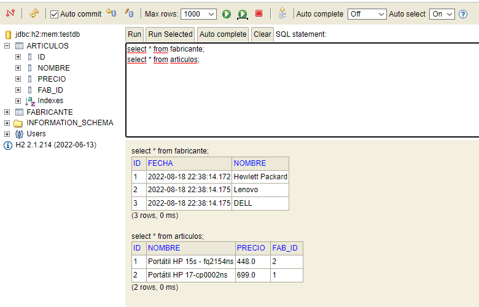
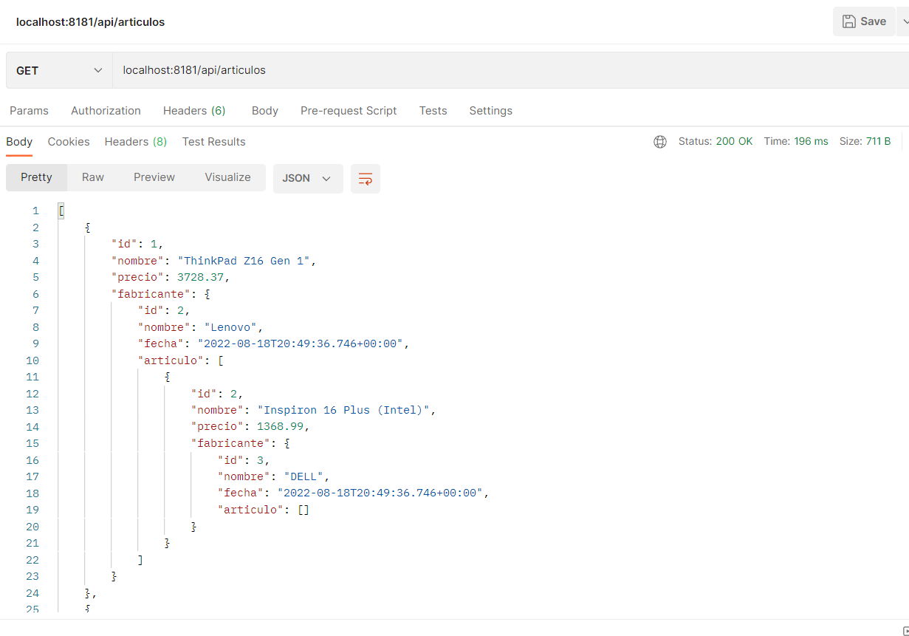

# Spring_REST_API-computer-store-manager
Spring Project with JPA + H2 (Simple CRUD N:N) + ER with at least Entities.
#
## ENDPOINTS

## GET
server/api/fabricantes 
server/api/fabricantes/{id} 
server/api/articulos 
server/api/articulos/{id}
## POST
server/api/fabricantes 
server/api/articulos
## PUT
server/api/fabricantes/{id} 
server/api/articulos/{id}
## DELETE
server/api/fabricantes/{id} 
server/api/articulos/{id}
##

